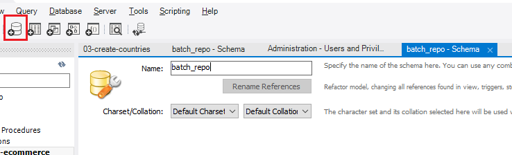
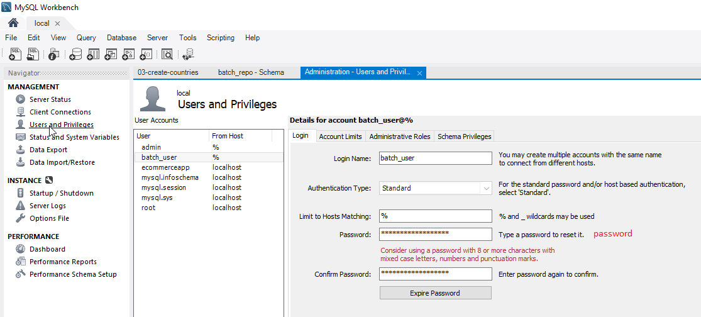
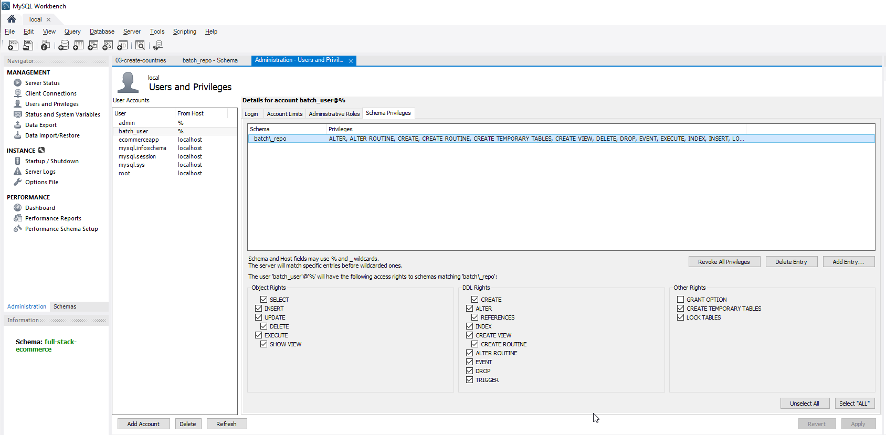
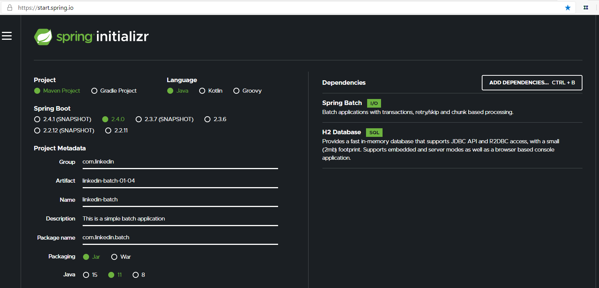
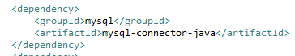

# Spring Batch
https://www.linkedin.com/learning/spring-spring-batch

## Create Schema

## Add User
 

## User Privileges

## Generate Spring Application (I changed to Java 1.8)

## Change H2 entry to MySQL

